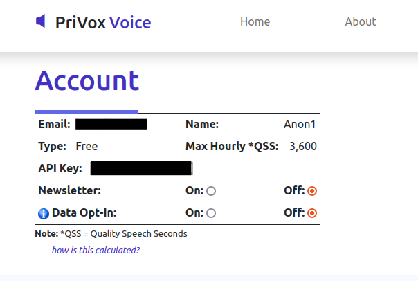

The Website
***********

.. toctree::
   :maxdepth: 2

=======
Profile
=======

The website provides the interface for users to see their production and consumption numbers as well as their basic account information and any active producer sessions. You access your profile page by clicking the profile icon near the upper right of your screen, once you are logged in.

.. figure:: _static/privox_header.png
   :class: with-border

   User select section of header

The website has a limited 'profile' page which shows the user email address, API key and a few other basic attributes.

   User Profile account info

Users consume resource (technically QSS) each time they request transcription from an API. They also accumulate QSS each time they produce. This information is summarized in the table in the middle of the profile page and it will look something like this ...

.. figure:: _static/profile_middle.png
   :class: with-border

   User Profile consumption overview

Below this table is a list of producer sessions associated with the user. If you have not contributed yet you will see a blank table near the bottom of your page otherwise you will see something like this.

.. figure:: _static/profile_bottom.png
   :class: with-border

   User Profile producer nodes

============
Transactions
============

If you have produced any active sessions you can view every transaction for every session on your transactions page. This is accessible by clicking the bell icon near the upper right of your screen when you are logged in. This will bring you to a transaction detail page which will look similar to this.

.. figure:: _static/transactions.png
   :class: with-border

   Sample user transactions page

===============
System Capacity
===============

Total system capacity is a function of all active nodes at any given point in time across the entire network. These numbers may be seen on the 'about' page of the website, near the middele of the page.

.. figure:: _static/network_capacity.png
   :class: with-border

   Network Capacity on the about page

